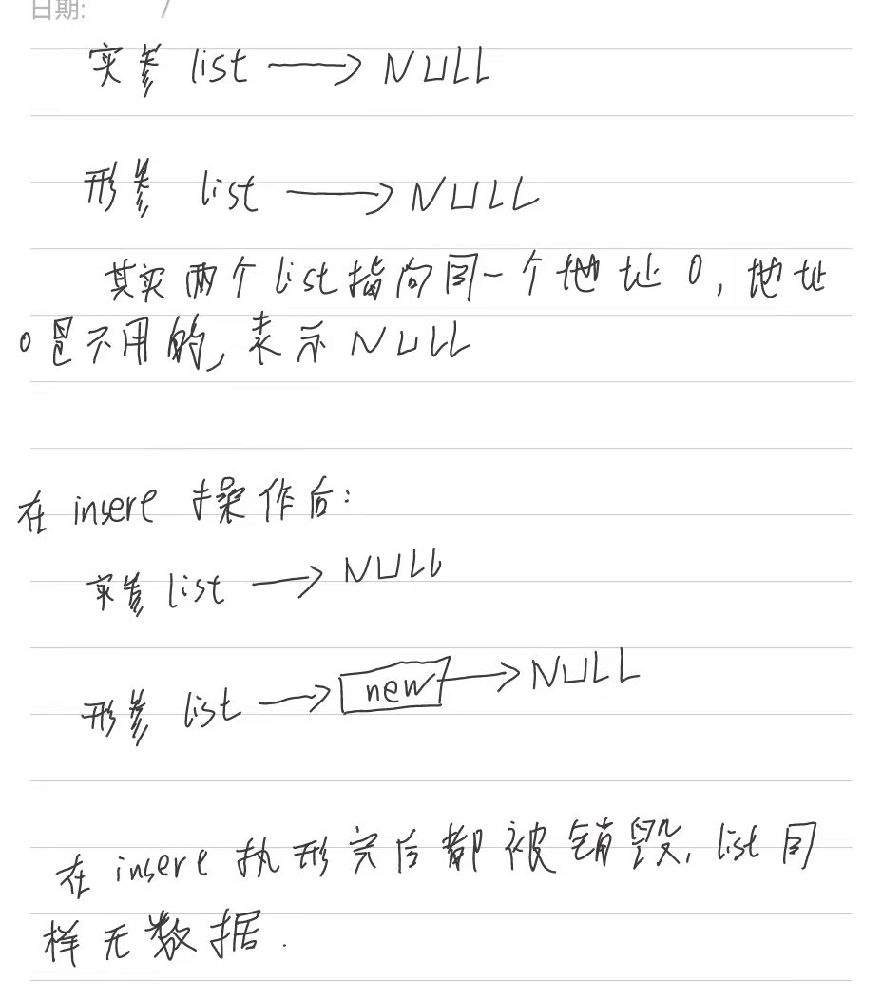

#### 有头节点的链表和无头结点的链表之间的注意事项

首先看下面例子：

- 无头结点的代码
    main.c
    ```
    #include <stdio.h>
    #include <stdlib.h>

    #include "list.h"

    int main () {

        stu_node *list = NULL;
        score tmp;                      // 采用变量的形式定义，不然用指针还要为它分配内存
        int i;

        for (i = 0; i < 7; i++) {

            tmp.id = i;
            snprintf (tmp.name, NAMESIZE, "str%d", i);
            tmp.math = rand () % 100;
            tmp.chinese = rand () % 100;

            list_insert(list, &tmp);

        }

        list_show (list);

        

        exit (0);
    }

    ```
    list.c
    ```
    #include <stdio.h>
    #include <stdlib.h>

    #include "list.h"


    int list_insert (stu_node *list, score *data) {

        stu_node *new;

        new = malloc (sizeof (*new));
        if (new == NULL) {
            return -1;
        }

        new -> data = *data;
        // new -> next = NULL;

        new -> next = list;
        list = new;

    }
    
    ```
    这段程序看着好像没错误，但是在 list_insert 这个函数执行完后，并没有插入到 list 中，插入的数据而是丢失了。

    原因是在 main 函数中，定义了 list 后初始化指向了 NULL,而用函数 list_insert 传过去后，复制了一份一样的地址，同样指向 NULL, 在插入函数里面的操作，全都是对复制的那个指针操作的（main 函数中的那个指针还是指向 NULL），而 insert 函数执行完后，把操作过的那个指针就被销毁了，这样就导致数据丢失了。

    

    而在带头节点的代码中，初始化时是指向了一个头节点的，不是 NULL ，所以传过去后，即使是地址的复印份，但 insert 可以对这个地址操作（也可能是为这个指针分配了内存，inser 是对内存操作，而无头结点的是对指针赋值，改变了指向）。

    正确的应该为 list_insert 函数的返回值改为 stu_node * ,然后再 main 函数中在调用 list_insert 函数时，用 list 接收返回值，这样才不会丢失。（或者用二级指针传参），这样直接操作的就是 main 函数中的 list 指针。

    所以在操作没分配空间的指针时要注意用二级指针传参（当然也可以用另一种不是二级指针的方式）。


