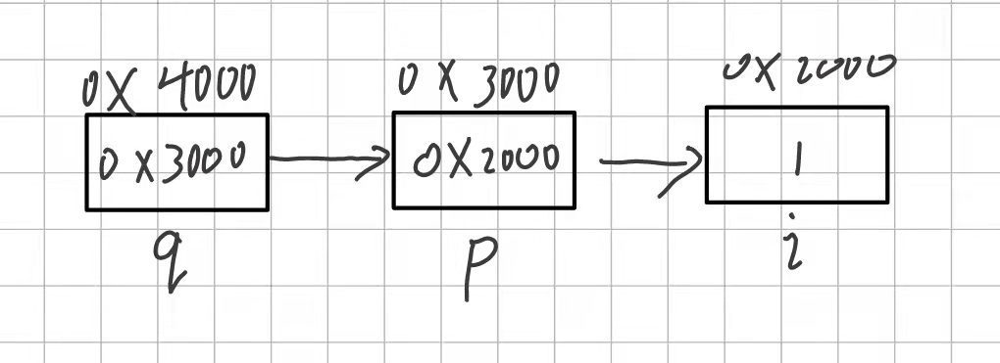

#### 1. 变量与地址

```
int i = 1;
int *p = &i;
```

p 就是一个指针变量，用来存放变量 i 的地址值，所以我们平常所说的定义一个指针指向一个值，其实就是定义一个指针变量来存放这个值的地址。
`int **q = &p;`

p 是一个指针变量，q 是用来存放指针变量 p 的地址值的变量，即定义时一个 * 指存放地址的变量，** 指是用来存放指针变量的地址的变量。要满足两边的类型相同。
```
int *p;
float *q;
double *d;
char *c;
```

不管定义的是什么类型的指针变量(即我们通常说的指针)，是几级的指针，以及定义的结构体类型的指针，其在某一个平台上所占的空间是确定的大小，在 64 位的机器上占 8 个字节。

不同类型的指针，其在运算时，如 *p 在做取值运算时，若 p 为 char ，则取一个字节，int 时，则取四个字节，所以什么类型的数据，要对应什么类型的指针，不然在取值时取得的大小与实际不符。

#### 2. 指针与指针变量(上面也有解释)

> 指针：就是一个地址，是常量，不会变的。
> 指针变量：用来存放指针的变量，可以改变。
> 我们常说的某指针指向谁，哪个指针又指向谁，是指改变指针变量的值

#### 3. 直接访问与间接访问

```
int i = 1;
int *p = &i;    
int **q = &p;

 i --> 1                        q --> 0x3000 --> &p
&i --> 0x2000                   &q --> 0x4000 
 p --> 0x2000    --> &i         *q --> *(&p)  --> &i
&p --> 0x3000                  **q --> *(*q)  --> *(&i) --> 1
*p --> *(0x2000) --> 1
```



#### 4. 空指针与野指针

> 野指针：int *p = 0x2000; 这种直接赋地址的形式，因为你不知道这块地址是否可用，通常很危险。
> 空指针：int *p = NULL; NULL 即为位于地址 0 的位置，0 号地址不分配给任何进程，指针定义出来后暂时还不知道指向哪里时，则将它指向 NULL；

#### 5. 空类型

```
void *q = NULL;     
```

> 任何类型的指针值都能够把自己的值赋给 void *， void * 也能够把当前自己的值赋给任何类型的指针。当自己不知道要用到什么类型的值时使用。

#### 6. 定义与初始化的书写规则

#### 7. 指针运算

```
*     &   关系运算   ++   --
```

\*p++：等同于：\*p;  p += 1;

解析: 但是，因为 ++ **后置**的时候，本身含义就是先运算后增加1（运算指的是p++作为一个整体与前面的 \* 进行运算；增加1指的是p+1），所以实际上 \*p++ 符号**整体对外表现的值**是 \*p 的值，运算完成后 p 再加1.
\*++p：等同于 p += 1;    \*p;

解析：由于 ++ 在 p 的前面，++ 前置的含义是，先 p 加1，得到一个新的p（它的值是原来p的值加1）。然后这个新的 p 再与前面的 \* 结合.

#### 8. 指针与数组

- **指针与一维数组**
    ```
    int a[3] = {1,2,3};
    int *p = a;
    int i;
    ```
    a[i] = *(a + i) = *(p + i) = p[i];
    &a[i] = a + i = p + i = &p[i];

    这样看来指针(指针变量)好像是等价于一维数组的，但是它们是不完全等价的，首先，a 是地址，是一个常量，p 是指针变量，是一个变量，a++ 是不能运算的 (a = a + 1), 常量不能出现在运算符左边进行赋值操作，但 p++ 可以。
    ```
    p++    -->  p = p + 1 --> p 的指向已经改变
    p + 1  -->  p 的指向未改变  
    ```

- **指针与二维数组**
    **二维数组结合指针的理解**: a[i][j] 相当于是数组名为 a[i],然后取第 j 个元素，即为 a[i][j],用指针的形式表示为：\*(\*(a + i) + j); (a + i) 是先按行移动指针，移动的 ‘1’ 就是一行，即一行 j 个元素，移到第 i 行的首地址，此时 (a + i) 还只是 a[i] 的函数名，即在第 i 个数组的函数名地址，要想取 a[i] 还要加一个 \* 进行取值操作，结果为 a[i]（具体可参考[二维数组的二次分配](https://chong589.github.io/2024/%E4%BA%8C%E7%BB%B4%E6%95%B0%E7%BB%84)）, 而 a[i] 又为 a[i][j] 的函数名，即地址，a[i] + j 为 a[i][j] 的地址，\* 取值后成为 a[i][j].

    **二维数组的二次分配解析: 二维数组的行指针就是一个二级指针用于存储一级指针的地址，所以在分配行指针时大小就是一个指针变量的大小，它是存一级指针的地址。二维数组 a[i][j] 中，(a + i) 表示的就是取第 i 个二级指针变量里存的地址（就是一级指针的地址），而 \*(a + i) 就是取一级指针里的内容，即变量的地址（为a[i]）**

    ```
    int a[2][3] = {1,2,3,4,5,6};
    int i, j;
    int *p;
    ```

    `p = a` 是不允许的，因为 p 是在列指针上移动的，而 a 是在行指针上移动的，即 p + 1 和 a + 1 所表达的含义不一样，a + 1 是指加一行，p + 1 是加一个元素。

    `p = *a` 即为 `*(a + 0)` 此种形式是可以的，此时 \*a 取的是数组元素的地址,而不是存储元素地址的地址，使之在数组在列指针上移动，即每加 1 为一个元素大小。
    ```
    p = *a;
    for(int i = 0; i < 6; i++)
        printf("%d ",p[i]);
    printf("\n");
    ```
    二维数组也可以用这种方式输出。

- **指针与字符数组**
    ```
    char str[10] = {"hello world"};
    char *s; s = "china";
    ```

    C 语言中编译器会给字符串常量分配地址，如 "china"，存储在内存中的 0x3000, 0x3001, 0x3002, 0x3003, 0x3004, 0x3005; 字符串常量的本质表现是代表它的第一个字符的地址，即 0x3000; 所以 `s = "china"` 是可以的，此操作相当于 s = "china" = 0x3000; 但是 `str = "hello world"` 是不允许的，str 是地址常量，不能赋给它。

    所以 `printf("%s",s);` 是通过字符串首地址输出字符串，因为字符串在内存中是连续存放的，遇到 \0 结束

    其实它与 `printf("%s",0x3000);` 是等效的，前者是用了一个指针变量存储 0x3000, 后者是直接用地址，后者与 `printf("%s",str)` 等价，因为 str 就是地址常量，则可以 s = str, 但不能 str = s;

    因为 s 为指针变量，本身就是可以存地址的，将 str 的地址赋给 s 就是将数组 str[] 的首地址给指针 s。 而 str = s , str 在定义的时候就已经分配了地址空间，即首地址是已经固定了的，而 str = s 这样是在改变它的地址了，肯定不可能。

    `char *s = "china";` 的本质是一个指针变量，只占八个字节(64位机器中)，用来保存第一个字符的地址(str 就是一个地址)，它可以用 `printf("%c",s[i]);` 逐个输出字符，或 `printf("%c",*s++);` s[i] 就是 *(s + i)；例：

    ```
    char str[] = "hello";
    printf("%d %d\n",sizeof(str),strlen(str));
    strcpy(str,"world");
    puts(str);
    ```

    `sizeof(str)`为 6 字节，`strlen(str)` 为 5 字节，而`puts(str)`输出为 world,正确输出。**strcpy 是将 world 复制到常量地址 str 开头的地址空间中**。

    ```
    char *s = "hello";
    printf("%d %d\n",sizeof(s),strlen(s));
    strcpy(s,"world");
    puts(s);
    ```
    这段程序会报段错误（Segmentation Fault），为什么数组 str 不会，而用指针 s 就会，这就要理解内存分配的问题了，要使用内存，必须先分配了才能使用。

    定义了指针要为其分配内存才能使用，我们平时直接指向变量、数组等，好像并没有分配内存也直接用了，其实你在定义变量、数组后，已经为变量，数组分配了空间，你让指针指向它们，是可以直接使用的。

    而字符串常量 "hello" 赋给指针的本质是将字符串所在的空间的首地址给指针，指针只存了首地址，并没有为指针分配空间，但是用 `char str[] = "hello";`,定义数组时就已经为数组分配了空间了。所以用数组不会报错

    通过 strcpy 的源码可知
    ```
    //返回char*的原因是 可以在其他函数中直接调用。
    char * strcpy(char *dst,const char *src) {          // 源字符串参数用const修饰，防止修改源字符串 
        assert(dst != NULL && src != NULL);             // 检查指针的有效性  

        char *ret = dst;                                // 记下dst的初始地址防止找不到

        while ((*dst++=*src++)!='\0');                  // 将src中所有字符(包括'\0')一个字符一个字符的拷贝到dst(包括'\0')。在赋值完'\0'后，循环停止

        return ret;
    }
    ```
    观察可知，在复制的过程中，dst++ 会移动，即 s++ ，而又没有为指针 s 分配内存，你这样做是访问未分配给你的内存，自然就报段错误

#### 9. const 与 指针

- **const 的概念**
const 关键字是一种修饰符。所谓“修饰符”，就是在编译器进行编译的过程中，给编译器一些“要求”或“提示”，但修饰符本身，并不产生任何实际代码。就 const 修饰符而言，它用来告诉编译器，被修饰的这些东西，具有“只读”的特点。在编译的过程中，一旦我们的代码试图去改变这些东西，编译器就应该给出错误提示。

- **与 define 的区别**
    define 定义的对象没有数据类型，编译器只能机械地进行字符替换，没有类型安全检查，即会出现“边际问题”或者是“括号问题”。而 const 定义的是变量，有数据类型。如：我们想要这样定义
    ```
    #define PI 3.14
    ```

    但是我们不小心写成了
    ```
    #define PI sdlkf
    ```

    编译器也不会报错，而是编译时直接用该值替换，如果用 const 则不会，它本身就是变量，有数据类型，会进行安全检查，sdlkf 是 char ，而 3.14 为 float ，这样编译器就会报错。同样，define 还会出现括号问题,所以 const 既有变量的有点，又有 define 的优点。

- **const 变量**
    const 变量指的是，此变量的值是只读的，不应该被改变。如果我们在程序中试图修改 const 变量的值，在编译的时候，编译器将给出错误提示(即在代码中出现赋值给 const 变量的语句)。正因为 const 变量的值在给定以后不能改变，所以 **const 变量必须被初始化**。（如果不初始化，之后还怎么赋值呢？）如果我们不初始化 const 变量，编译时也会有错误提示。
    定义形式：
    ```
    const int a;
    int const a;
    ```

    这两种定义方式都是可以的，但是记得一定要初始化。
    ```
    const float pi = 3.14;
    float *p = &pi;
    *p = 3.14159;
    ```

    这样通过指针来改变 pi 的值编译器可以通过，但是这样也是非常危险的。会出现警告：初始化丢弃了指针目标类型的限定。正确的做法应该为 `const float *p = &pi;`,即指向 const 变量的指针也应该定义成 const 类型。所以说 const 变量也不是不可以改变的。即不通过改变量来修改值，而是通过指针间接修改。

- **常量指针**
    常量指针是指针指向的内容是常量
    ```
    const int *p;
    int const *p;
    ```

    可以结合以下方法记忆

    `int *p;` 为整型指针，是指向整型的指针，自然 `const int *p` 就为指向常量的指针。

    常量指针说的是**不能通过这个指针改变变量的值**，但可以通过其他的引用来改变变量的值。
    ```
    int cnt = 5;
    const int* num = &cnt;
    cnt=6;
    ```

    即不能 `*num = 6;` 这样改变值，但可以 `cnt = 6;`来改变。如果 cnt 也加上 const 来限定就不可以这样来改了。
    所以要想不改变一个变量的值，应该这样：
    ```
    const float pi = 3.14;
    const float *p = &pi;
    ```

    这样无论是用指针 p 还是用变量 pi 都无法修改 pi 的值。
    常量指针指向**地址中保存的值不能改变**，但是**指向的地址可以改变**。
    ```
    int cnt = 5;
    int tmp = 6;
    const int* num = &cnt;
    num = &tmp;
    ```

    联想记忆：可以想象成它定义的是 *p ,而它表示指针指向的值，则表示值不能改变。

- **指针常量**
    指针常量是指指针本身是个常量，不能再指向其他的地址，写法如下：
    ```
    int *const p;
    const int *const p;
    ```

    需要注意的是，指针常量指向的**地址不能改变**，但是**地址中保存的数值是可以改变**的，可以通过其他指向该地址的指针来修改。
    ```
    int cnt = 5;
    int *tmp = &cnt;
    int* const num = &cnt;
    *tmp = 6;
    ```

    直接用 *num = 6; 也可以修改。 
    联想记忆：它定义的是 p ，表示一个地址，则为指向的地址不能改变。

- **指向常量的常指针**
    ```
    const int *const p;
    ```

    这相当于是常量指针与指针常量的结合，指针**指向的位置**不能改变并且也**不能通过这个指针改变变量的值**。

#### 10. 指针数组与数组指针(工作常用，指针函数、数组指针)

**数组指针**：像整型指针为指向整型的指针，而数组指针则为指向数组的指针。

>【存储类型】 数据类型  (*指针名)【下标】  = 值

```
int (*p)[3]; --> type name; --> int[3] *p;
```

type 可以是 int char double,以及结构体类型，上面这种为数组类型。int *p; p 每加一，p 移动一个 int 大小，而 `int (*p)[3]`即`int[3] *p`移动三个 int 大小。是数组间移动。
```
int a[2][3] = {1,2,3,4,5,6};
int i,j;
int *p = *a;
int (*q)[3] = a;
```

这种形式定义的 q 每加一，和 a 加一是一样的，q 加一，移动三个 int型元素大小，和二维数组的行指针一样。但要注意**区别**：a 是常量，q 是变量。**二维数组的本质就是一个数组指针**。

**指针数组**：数组中每个元素就是一个指针。
>【存储类型】 数据类型  * 数组名【下标】  = 值；
```
int * arr[3];  -->  TYPE NAME;
```

#### 11. 多级指针

