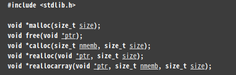

我们平时编程时经常会忽略一些细节，导致项目出现问题，且有些很难发现。

<!-- more -->
#### 1. 头文件正确包含的重要性
在程序中使用 **malloc 函数** 时，在程序开头未写头文件 **`#include<stdlib.h>`**，这时 gcc 没有看到 malloc 函数头文件的时候，也就看不到它的原型，那它会**默认 malloc 的返回值为 int 型**，如以下程序。
```
#include <stdio.h>

int main(void){

    int *p = NULL;

    p = malloc(sizeof(int));
    if(p == NULL)
        return -1;
    
    return 0;

}
```
默认 malloc 函数的返回值为 int 型后，而程序中接收的是 int* 型指针，这样就会报错。有人会这样解决问题：`p = (int*)malloc(sizeof(int));`,使用强制转换类型，有时有些编译器不会报错，但是以后经过移植或换个环境等的时候，这个问题就会出现，导致很难找出来。通过 man malloc 查看可知：



malloc 函数返回的是 void* 类型的值，而 void 可以转变为大部分的类型，所以可以这样写 `p = malloc(sizeof(int))`

以后使用 gcc 编译时可以用参数 -Wall ,它会显示全部错误，你只要按照出现的错误一个个解决，后面出现的大部分错误都是来源于这，因为你不把这些错误用 -Wall 打印出来，gcc 有些错误在你编译时没有非常严重的错误，它是会忽略的。

例：`gcc hello.c -Wall`

#### 2. 以函数为单位来进行程序编写

#### 3. 声明部分 + 实现部分

#### 4. 对于宏定义的理解

`#define` 处理在程序的预处理阶段，占编译时间，特点是，一改全改。缺点：**不检查语法**，只是单纯的宏体与宏名之间的替换。例如以下程序：
```
#include <stdio.h>
#include <stdlib.h>

#define ADD 2 + 3

int main(){

        printf("%d\n",ADD * ADD);

        exit(0);
}

```
结果为：11

明显结果不是我们想要的 25，我们用 gcc 的预编译命令 `gcc -E defind.c` 查看

`printf("%d\n",ADD * ADD);` 
`printf("%d\n",2+3 * 2+3);`

从这里可知宏定义就只是在预编译时单纯的将宏体替换宏名。这里想要正确输出，则要这样定义：`#define ADD (2+3)`

带参数形式的使用：
```
#include <stdio.h>
#include <stdlib.h>

#define MAX(a,b)   (a > b ? a : b)

int main(){

        int i = 5, j = 3;

        printf("%d\n",MAX(i,j));

        exit(0);
}
```
输出为：5
但是逻辑上 a 和 b 也应该各自加上括号，因为传参时的数要考虑到运算的优先级,因为无论是 a 还是 b 在这里都是单独的个体，且可以是 a = 1 + 3 的形式，这样组合起来就要考虑优先级问题，1 + 3 是要自己单独运算的。

`#define MAX(a,b)   ((a) > (b) ? (a) : (b))`

当程序改成如下后
```
#include <stdio.h>
#include <stdlib.h>

#define MAX(a,b)   ((a) > (b) ? (a) : (b))

int main(){
        
        int i = 5, j = 3;       
       
        printf("i = %d\tj = %d\n",i,j);
        printf("%d\n",MAX(i++,j++));
        printf("i = %d\tj = %d\n",i,j);

        exit(0);
}

```
将参数改成 i++ 和 j++。结果输出如下
```
i = 5	j = 3
6
i = 7	j = 4
```
理论上 i = 5 和 j = 3 先进行比较，然后各自自增，i 大，则第二行的输出结果为 i 自增后的结果6（先比较后自增），第三行应为 i = 6，j = 4.可结果不是。
预编译的结果为

`printf("%d\n",((i++) > (j++) ? (i++) : (j++)));
`

根据这串语句可知，i 和 j 先比较，然后各自自增，由于 i 大，则执行 ？ 后面的 i++，这样 i 就再次自增了一次，所以第三行的 i 为自增了两次的。 

解决方法：像函数的参数一样，用变量接收自增后的结果，而不是在比较完后，又将参数 i++ 执行一次，而是执行的是 i++的结果。

```
#define MAX(a,b)   ({
                        int A = a, B = b;
                        ((A) > (B) ? (A) : (B));
                    })

i = 5	j = 3
5
i = 6	j = 4
```
预编译结果为：
```
printf("%d\n",({int A = i++, B = j++; ((A) > (B) ? (A) : (B));}));
```
这样用变量接收后，则在比较完后执行时就不是执行 i++了，而是执行 A 这个值。
有时参数未必都是 int 型，则可以

`#define MAX(a,b)   ({typeof(a) A = a, B = b; ((A) > (B) ? (A) : (B));})
`

用 a 的类型定义 A , B。用 typeof() 函数获取类型。

