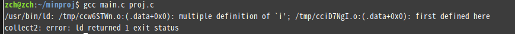

<!-- more -->

static 不仅有**继承性**，另外，常用于修饰任何变量或者是函数，使用 static 定义的变量，它会自动初始化为 0。

##### 1. 解决变量冲突问题

首先有一个 minproj 的工程文件，该文件下有 main.c  proj.c  proj.h 三个文件

main.c : 写函数的调用
proj.c : 函数的实现
proj.h ：函数声明的位置

main.c
```
#include <stdio.h>
#include <stdlib.h>

#include "proj.h"

int i = 10;

int main(){

        printf("[%s]: i = %d\n",__FUNCTION__,i);
        func();
        exit(0);

}

```
proj.c
```
#include <stdio.h>
#include <stdlib.h>

#include "proj.h"

int i = 100;

void func(void){
        
        printf("[%s]: i = %d\n",__FUNCTION__,i);
        exit(0);

}

```
proj.h
```
#ifndef PROJ_H___
#define PROJ_H___

void func(void);

#endif

```
这三个文件当中的全局变量 i 按理来说它们都只作用在本 .c 文件中，因为它们的作用范围和生命周期是不同的，但是编译后出现了错误



显示对 i 的定义重复定义了。所以 main.c 和 proj.c 链接后的 i 会导致作用范围一样，即导致冲突。编译 --> 链接 --> 装入，链接时会出现两个文件的 i。

解决方法：
如果想要 main.c 和 proj.c 中的 i 变量作用在各自的 .c 文件中，则在各自定义 i 变量时加上关键字 static。像这样 `static int i = 10;`这样则当前文件修饰的变量只能在当前文件用，这样就不冲突了。

##### 2. 函数
将文件 proj.c 中修改
```
static void func(void){
        
        printf("[%s]: i = %d\n",__FUNCTION__,i);
        exit(0);

}

```
在 proj.h 中声明时也加上 static
在函数前加了个 static,使其只能在当前文件使用。编译函数

即在 proj.c 文件中，该函数定义只能在该 .c 文件中使用，声明时也同样，所以在 proj.h 中声明时是用不了的，而在 main.c 文件中又使用了 func(), 这样就导致未定义就使用 func() 。

**在函数定义是加上 static 是防止当前函数对外扩展**

解决方法
main.c
```
#include <stdio.h>
#include <stdlib.h>

#include "proj.h"

static int i = 10;

int main(){

        printf("[%s]: i = %d\n",__FUNCTION__,i);
        call_func();
        exit(0);

}

```
proj.c
```
#include <stdio.h>
#include <stdlib.h>

#include "proj.h"

static int i = 100;

static void func(void){
        
        printf("[%s]: i = %d\n",__FUNCTION__,i);
        exit(0);
}

void call_func(){

        func();
}

```
proj.h
```
#ifndef PROJ_H___
#define PROJ_H___

void call_func();

#endif

```

func() 函数还是只能在本文件使用，只不过借助了一个 call_func() 函数来执行 func().这样就能保证 func() 在本文件中使用，而在其他文件中通过调用 call_func() 来执行 func().

#####总结

1. 防止工程中链接各文件时，出现相同变量的问题，将变量用 static 定义
2. 在函数定义是加上 static 是防止当前函数对外扩展