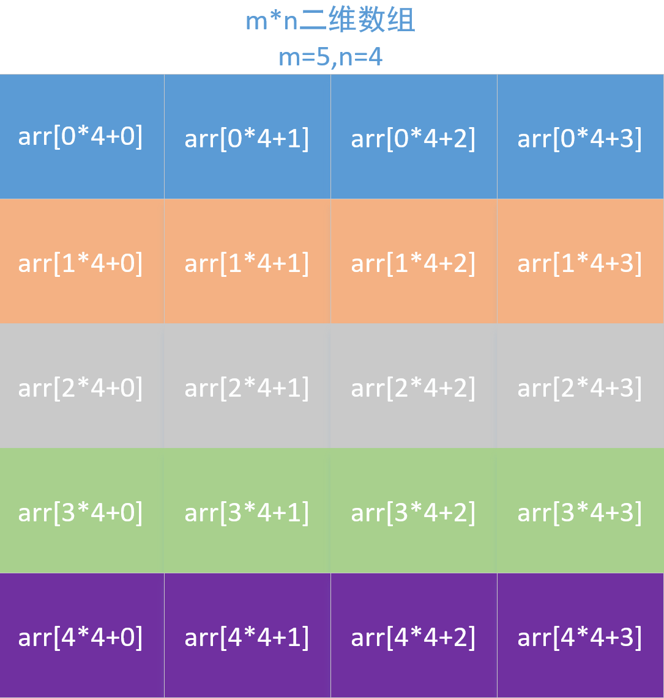

## 二维数组的分配

假设要为一个 m * n 的数组分配内存空间

### 1. 一次分配



这种分配就是把它当作一维数组来分配，通过 i 和 j 的值，计算出具体位置。该分配的内存必须是连续的。

```
int *arr = (int *)malloc(sizeof(int) * m * n);

for(int i = 0; i < m; i ++){
    for(int j = 0; j < n; j ++){
        arr[i * n + j] = 1;
    }
}
```
**注意每个元素的下标和 i 、j 的关系**

### 2. 二次分配


首先分配一个指针数组 `*arr[i]`,以行为单位，一行表示一个指针，该指针数组中的每个元素都是一个数组指针，该指针又指向一个一维数组。**后面再对该数组指针分配内存空间**(即对一维数组分配)，这种二维内存的分配是分两次来分配的，因此分配的内存是不连续的。

```
// 为指针数组分配内存
int **arr = (int **)malloc(sizeof(int *) * m);
// 为每个指向数组的指针分配空间，即每个指针只需一个指针变量接收，共有 m 个。

// 再为每个指针数组分配内存空间
for(int i = 0; i < m; i ++){
    arr[i] = (int *)malloc(sizeof(int) * n);
}
```
