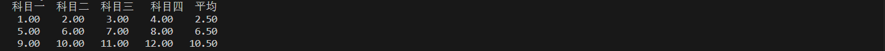

#### 1. 函数的定义

> 数据类型   函数名   (形参说明)

```
int main (int argc, char *argv[]) {

    return 0;
}
```

argc 是一个计数器，计算从终端传了多少个参数过来。argv[] 是一个列表，用来保存传过来的参数。

#### 2. 函数的传参

    值传参
    地址传参
    全局变量

#### 3. 函数的调用

- 嵌套调用
- 递归调用 (面试常考，非常考验编程功底)
    阶乘
    ```
    #include <stdio.h>
    #include <stdlib.h>

    int func (int n) {

        if (n < 0)
            return -1;
        
        if (n == 0 || n == 1)
            return 1;
        return n * func (n - 1);
    }

    int main () {
        int n;
        int res;

        scanf("%d",&n);

        res = func(n);

        printf("%d! = %d\n",n,res);
        
        exit(0);
    }
    ```

    斐波那契数列
    ```
    #include <stdio.h>
    #include <stdlib.h>

    // 1, 1, 2, 3, 5, 8, 13, 21, 34......

    // n = (n - 1) + (n - 2)
    // (n == 1 || n == 2)  --->   return 1;  

    int fib (int n) {

        if (n < 0)
            return -1;
        if (n == 1 || n == 2)
            return 1;
        
        return fib (n - 1) + fib (n - 2);
    }

    int main () {

        int n;
        int res;

        printf("请输入你要求的斐波那契数列的项数：\n");
        scanf("%d",&n);

        res = fib(n);
        printf("fib[%d] = %d\n",n,res);

        exit(0);
    }
    ```

#### 4. 函数与数组

- **数组传参方式**
    传参时传的是数组的首地址，所以还要传数组的大小。
    ```
    #include <stdio.h>
    #include <stdlib.h>

    void print_arr (int *p, int n) {

        int i;
        for (i = 0; i < n; i++)
            printf("%d ", p[i]);
        printf("\n");

    }

    int main () {

        int a[] = {1, 2, 3, 6, 6, 7};

        print_arr(a,sizeof(a) / sizeof(*a));

        exit(0);
    }

    ```

    在 print_arr 函数中，接收数组的是一个指针变量，也就是接收的是数组首地址，实际上这个函数是不知道数组的大小的，只知道数组首地址，而在定义函数时用 sizeof(p) / sizeof(*p) 是不可行的，sizeof(p) 肯定是 8 字节，这是固定的，这算出来的是接收地址的指针变量的大小，并不是数组的大小。所以在传参时要传数组的大小。

    ```
    void print_arr (int p[], int n)
    ```

    定义时这样写成数组的形式，看似好像是把整个数组传过去了，实则不然，它的含义仍然是指针变量，跟上面是一样的。
    所以在形参中定义成数组的形式和在 main 函数中定义时是不一样的，作为形参时，它就是指针变量。

    ```
    int a[N] = {1, 2, 4, 5, 6};
    int *p = a;

    实参：         a       *a           a[0]        &a[3]       p[i]        p       *p          p+1
                           *(a+0)                               *(p+i)              *(p+0)
    形参接收类型： int*     int          int         int*        int         int*    int        int*     
    ```

    数组逆序实现
    ```
    #include <stdio.h>
    #include <stdlib.h>

    void func (int *a, int n){

        int i, j, tmp, mid;

        mid = (n - 1) / 2;

        for(i = 0; i <= mid; i++){

                j = n - 1 -i;
                tmp = a[i];
                a[i] = a[j];
                a[j] = tmp;

        }

    }

    int main () {

        int a[] = {1, 3, 5, 7, 9};

        // puts(a);     puts 是用于输出 char * 
        int i;
        for(i = 0; i < sizeof(a) / sizeof(*a); i++)
            printf("%d ", a[i]);
        printf("\n");

        func(a,sizeof(a) / sizeof(*a));

        for(i = 0; i < sizeof(a) / sizeof(*a); i++)
            printf("%d ", a[i]);
        printf("\n");

        exit(0);
    }
    ```

- **函数与二维数组**
    方式一：
    ```
    #include <stdio.h>
    #include <stdlib.h>

    #define M   3
    #define N   4

    void print_arr (int *p, int n) {

        int i;
        for(i = 0; i < n; i++){

            printf("%d ", p[i]);

        }
        printf("\n");

    }

    int main () {

        int a[M][N] = {1, 2, 3, 4, 5, 6, 7, 8, 9, 10, 11, 12};

        print_arr(&a[0][0], M * N);

        exit(0);
    }
    ```

    注意这里函数的形参采用的是一级指针接收，传入的实参不能直接传 a, a 为二维数组，为行指针，一级指针只能在列指针中移动，所以实参应转化为列指针 &a[0][0] 传入, 把二维数组当成一个大的一维数组，个数为 M * N 。这里 &a[0][0] 还可以为 \*a 、a[0]、\*(a + 0)。

    方式二：
    ```
    #include <stdio.h>
    #include <stdlib.h>

    #define M   3
    #define N   4

    // 二维数组 a 的本质就是一个数组指针,指向数组的指针
    void print_arr (int (*p)[N], int m, int n) {      // 或 void print_arr(int p[][N], int m, int n)

        int i, j;
        printf("sizeof(p) = %d\n",sizeof(p));   //  结果为：8，所以也是一个指针变量，不过这个指向的是一个数组，数组大小为 N 个元素

        for(i = 0; i < m; i++){

            for(j = 0; j < n; j++){
                printf("%4d ", *(*(p + i) + j));     // 或 printf("%4d ", p[i][j]);  
            }
            printf("\n");

        }
        printf("\n");

    }

    int main () {

        int a[M][N] = {1, 2, 3, 4, 5, 6, 7, 8, 9, 10, 11, 12};

        printf("sizeof(a) = %d\n",sizeof(a));      // 结果为 48

        print_arr(a, M, N);

        exit(0);
    }
    ```

    如果想在实参中传入一个二维数组，而不是把它当成一维数组传入，那么在函数定义时的形参中要有与二维数组相对应的类型，前面已学过**二维数组的本质就是数组指针**，所以要接收一个二维数组，就应该在形参中用数组指针接收，a + 1 和 p + 1 效果是一样的，都是行指针。int (*p)[N] 中 N 为二维数组的列数。将二维数组接收过来后，对应的行数和列数也接收过来了，接下来就跟平时处理二维数组时一样。

    同样，跟一维数组一样，传过来的数组，接收的是首地址，同样不知道大小，所以还要传大小参数。
    ```
    int [M][N] = {};
    int *p = *a;
    int (*q)[N] = a;

    实参：      a[i][j]     *(a+i)+j        a[i]+j      p[i]        *p      q[i][j]     *q       q              p+3     q+2
                                                                                        *(q+0)
    形参类型：  int          int *          int *       int          int     int         int *   int (*)[N]    int *    int(*)[N]

    ```

    练习题
    求每个学生的平均成绩
    ```
    #include <stdio.h>
    #include <stdlib.h>

    #define M   3
    #define N   5

    void print_arr (float (*p)[N], int m, int n) {

        int i, j;
        printf("  科目一  科目二  科目三   科目四  平均\n");

        for(i = 0; i < m; i++){

            for(j = 0; j < n; j++){
                printf("%7.2f ", *(*(p + i) + j));
            }
            printf("\n");

        }
        printf("\n");

    }

    // 求每个学生的平均成绩，并把平均成绩写在后面
    void average (float (*p)[N], int m, int n) {

        int i, j;
        for(i = 0; i < m; i++){
            float tmp = 0;
            for(j = 0; j < n; j++){
                tmp += p[i][j]; 
            }
            p[i][4] = tmp / (N - 1);

        }

    }

    int main () {

        float a[M][N] = {{1, 2, 3, 4}, {5, 6, 7, 8}, {9, 10, 11, 12}};
        
        average(a, M, N);
        print_arr(a, M, N);

        exit(0);
    }
    ```

    

    求总平均成绩和把指定学生的四科成绩打印出来
    ```
    #include <stdio.h>
    #include <stdlib.h>

    #define M   3
    #define N   4

    float average_scope(int *p, int n) {
        float sum = 0;
        int i;

        for(i = 0; i < n; i++) {
            sum += p[i];
        }
        return sum / n;
    }

    void find_num(int (*p)[N], int num) {

        int i;
        for(i = 0; i < N; i++) {
            printf("%d ", *(*(p + num) + i));
        }
        printf("\n");

    }

    int main () {

        int a[M][N] = {1, 2, 3, 4, 5, 6, 7, 8, 9, 10, 11, 12};
        int i, j;
        float ave;
        int num = 0;

        ave = average_scope(*a, M * N);
        printf("ave = %.2f\n", ave);

        find_num(a, num);

        exit(0);
    }
    ```

- 函数与字符数组

    strcpy 的实现，它在库中的封装方式为：

    `char *strcpy (char *dest, const char *src); `

    src 为常量指针，不能通过该指针改变变量的值，因为该指针的内容是不能改变的。所以自己实现 strcpy 的代码也可用这种形式：

    ```
    #include <stdio.h>
    #include <stdlib.h>

    char *mystrcpy (char *dest, const char *src) {

        char *ret = dest;                   // 用 ret 记录 dest 的头指针，因为下面 dest++ 指针会移动
        if (dest != NULL && src != NULL)    // 最后返回 ret 即可
            while ((*dest++ = *src++) != '\0');
        
        return ret;

    }

    int main () {

        char str1[] = "helloworld";
        char str2[128];

        mystrcpy (str2, str1);

        puts (str2);                // puts 会自动在后面加换行符

        exit (0);
    }
    ```

    strncpy 实现
    ```
    char *mystrncpy (char *dest, const char *src, size_t n) {

        int i;
        for (i = 0; i < n && (dest[i] = src[i]); i++) {
            // (dest[i] = src[i]) 作用是一边拷贝到 dest 中，一边用作判断，当 (dest[i] = src[i])
            // 的值为 \0 即在 && 运算中式子不成立，跳出循环,因为 有时 src 的长度会小于 n ，即 src 
            // 不够长, 那就只拷贝 src 那么长的

        }
        
        // i < n 时才拷贝 \0, i >= n，会自动跳过这条语句
        for (; i < n; i++)
            dest[i] = '\0';
        
        return dest;

    }
    ```
    若 src 没有 n 那么长，经过 (dest[i] = src[i]) 将 \0 复制到了 dest 中,且判断跳出循环，这时 \0 是赋值到了字符串中的，当 src > n 时，是因为 i < n 跳出的，\0 并无拷贝，最后应该将 dest[i] = '\0';

#### 5. 函数与指针

##### 指针函数 (返回值为指针)

根据 Type name 可知，指针函数是定义函数，所以为
定义形式：返回值 函数名 （形参）  如：`int *fun (int)`

用途：例如前面 find_num 的实现，它只让你找到第几个学生的成绩，并没有然你输出，你却遍历输出那个学生的成绩，显然不是最完美的解决方案，这时就可以用返回一个指向函数的指针

理论上的实现方式：
```
int (*)[N] find_num (int (*p)[N], int num) {

    return (p + num);

}
```
把指针 p 移动到第 num 的学生的位置，由于 p 为行指针，所以理论上要这样写返回值就也要为对应的类型，即也要行指针，所以返回值为 int (*)[N],但是我们就只是想要得到第 num 行的那些数据，根本不需整个二维数组的形式返回来，只需在 num 行使用列指针即可，所以可以这样：
```
#include <stdio.h>
#include <stdlib.h>

#define M   3
#define N   4

int * find_num (int (*p)[N], int num) {

    if (num > M - 1)
        return NULL;        // 不能写 -1，因为返回类型为指针
    return *(p + num);     // 也可 p[num];

}

int main () {

    int a[M][N] = {1, 2, 3, 4, 5, 6, 7, 8, 9, 10, 11, 12};
    int i, j;
    int num = 0;
    int *res;

    res = find_num(a, num);
    if (res != NULL) {

        for(i = 0; i < N; i++)
            printf("%d ", res[i]);
        printf("\n");

    }else {
        printf("Can not find!\n");
    }

    exit(0);
}
```

##### 函数指针

记忆：整型指针为指针指向整型，那么函数指针自然就是指向函数的指针

根据 Type name 可知，函数指针是定义指针，所以为
定义形式：类型 （*指针名） (形参)  如: `int (*p)(int);`

类型：int (int) --> 函数和形参的类型
name: *p        
两个合起来就为 `int (*p)(int);`

```
#include <stdio.h>
#include <stdlib.h>

int add (int a, int b) {

    return a + b;

}

int main () {

    int a = 3, b = 5;
    int ret;
    int (*p) (int, int);

    p = add;            // 也可 p = &add; 函数名跟数组名一样，就是个地址

    // ret = add (a, b);  // 原来的写法

    ret = p (a, b);
    printf ("%d\n", ret);  

    exit(0);
}

```

##### 函数指针数组

指针数组：数组中每个元素就是一个指针
函数指针：指向函数的指针
函数指针数组：数组中每个元素都是一个指向函数的指针

定义：类型 (*数组名 【下标】)  (形参) 如：`int (*arr[N]) (int);`

类型：`int (int)` --> 函数和形参的类型
name: `*arr[N] `      
两个合起来就为 `int (*arr[N]) (int);`

##### 指向指针函数的函数指针数组

函数指针数组：数组中每个元素都是一个指向函数的指针
指针函数 (返回值为指针)，即这个函数是指针类型的
数组中的每个指向函数的指针

定义：`int *(*funcp[N])(int);`
指针数组：`(*funcp[N])`
函数指针数组: 要加上返回值类型和形参类型，即：`int (*funcp[N])(int)(int);`
指针函数：即返回值为指针（即返回值为地址），将里面的元素的返回值为整型指针，而不是整型。`int *(*funcp[N])(int);`

#### 总结

自己的理解：为什么不能直接调用函数，而是特地定义指针来，因为函数名是地址常量，函数指针是指针变量，有区别，就跟前面学的指针变量跟数组名一样的区别。

老师讲解：传参时如果传一个函数名过去(因为可能要用到某函数，将此函数传过去用)，这时形参就要定义一个同类型的来接收。
传整形数     ---->    整型指针接收
传数组名     ---->    指针接收
函数名       ---->    指向函数的指针来接收

如：快速排序的封装
```
void qsort (void *base, size_t nmemb, size_t size, int (*compar) (const void *, const void *));
```
此方式定义为函数指针，返回值为函数

总之就是为了满足传参的要求，这些函数叫**回调函数**。

**数组、指针与函数的结合**

**数组指针**：像整型指针为指向整型的指针，而数组指针则为指向数组的指针。
Type name
Type ---> 数组 ---> int[N]
name ---> 指针 ---> *p
Type name ---> int (*p)[N];

**指针数组**：数组中每个元素就是一个指针。
Type ---> int *
name ---> arr[N]
Type name ---> int *arr[N]

**指针函数**：定义函数
返回值 函数名 （形参）
返回值 ---> int *
函数名 ---> func

**函数指针**：指向函数的指针
定义指针
Type name
Type ---> int (int)
name ---> *p
int (*p) (int)

**函数指针数组**：数组中每个元素都是一个指向函数的指针
指针数组：int *arr[N]
函数指针：int (*p) (int)
只需将函数指针的指针名改为数组的形式就可
int (*arr[N]) (int)

**指向指针函数的函数指针数组**
指针数组是指向函数，那么指向指针函数的函数指针数组为指向指针函数，只需在定义函数的返回值时定义指针类型即可
int *(*func[N]) (int)